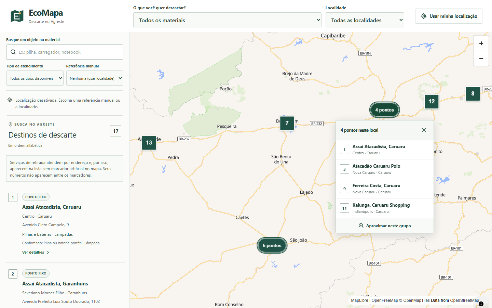
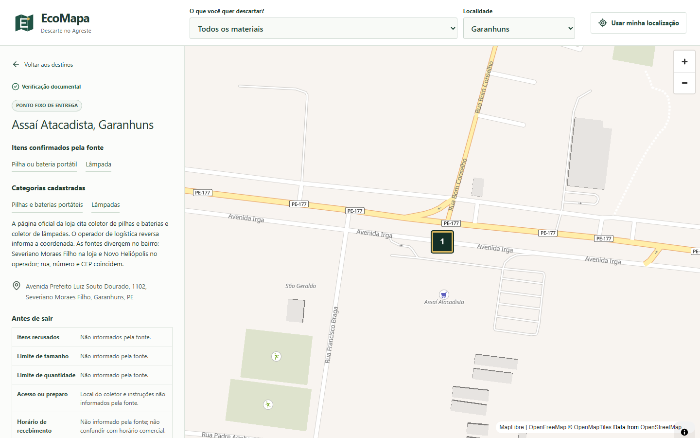
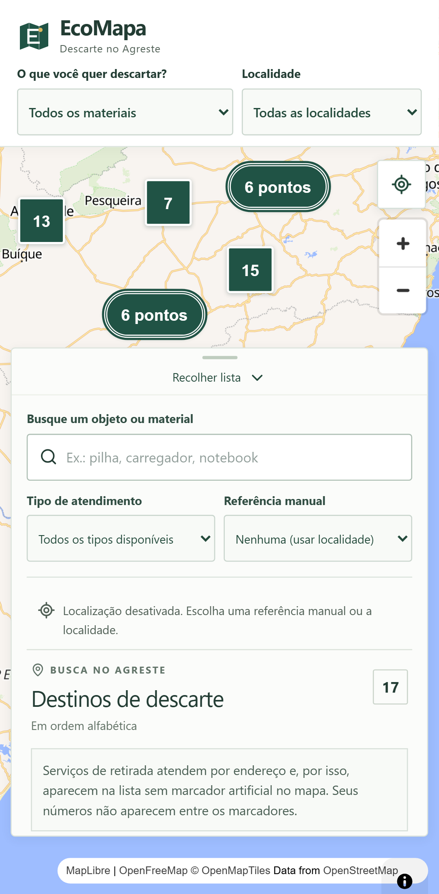

# EcoMapa

Aplicação web para encontrar pontos de entrega e serviços de retirada de resíduos em Garanhuns e no Agreste de Pernambuco. O usuário consulta o que cada destino recebe, as regras práticas, a fonte da informação e a data de verificação, e abre a rota no Google Maps ou o canal oficial do serviço.

**Site publicado:** https://ecomapa-garanhuns.pages.dev/

## Telas

Abertura no desktop, enquadrando toda a cobertura do Agreste. Marcadores sobrepostos viram um grupo que diz a quantidade e abre a lista dos destinos, cada um com o mesmo número que aparece na lista lateral.



Detalhes de um destino: itens confirmados pela fonte, categorias, endereço, o que a fonte não informa e a rota.



No celular o mapa ocupa a tela inteira e a lista sobe como painel.



## Stack e instalação

React 19, TypeScript estrito, Vite 8, Tailwind 4, Lucide, MapLibre 6, OpenFreeMap, Zod, Vitest e Playwright. Node 24 e npm; versões resolvidas no lockfile. Sem chave de API ou variáveis de ambiente obrigatórias.

```sh
npm ci
npm run dev
```

No PowerShell com scripts bloqueados, use `npm.cmd` e `npx.cmd`. Execute os comandos nesta pasta, onde está o `package.json`.

## Scripts e testes

| Comando | Uso |
| --- | --- |
| `npm run dev` | Servidor de desenvolvimento |
| `npm run typecheck` | Tipos da aplicação, configurações e testes E2E |
| `npm run lint` | Análise estática |
| `npm test` | Testes unitários |
| `npm run test:watch` | Testes durante edição |
| `npm run build` | Build estático em `dist/` |
| `npm run preview` | Servir o build localmente |
| `npm run test:e2e` | Fluxos de navegador contra o build |
| `npm run verify` | Tipos, lint, unitários, build e E2E, interrompendo na primeira falha |
| `npm run check:deploy` | Inspecionar o pacote público e registrar os hashes |
| `npm run test:deploy` | Testar os bloqueios de arquivos privados do verificador |

Antes do primeiro E2E: `npx playwright install chromium webkit`. Depois execute `npm run build` e `npm run test:e2e`. A suíte abre o preview na porta 4173 e testa Chromium desktop, Pixel 7 simulado e WebKit com perfil de iPhone 13. O teste de tiles reais precisa de internet. O relatório fica em `playwright-report/index.html`.

Para exercitar mapa e localização também com o Vite em desenvolvimento, no PowerShell:

```powershell
$env:PLAYWRIGHT_SERVER = 'dev'
npx.cmd playwright test basic-map.spec.ts geolocation.spec.ts map-network.spec.ts --reporter=list --output=test-results-dev
Remove-Item Env:PLAYWRIGHT_SERVER
```

Esse comando abre o próprio servidor na porta 4174 e não depende de um servidor iniciado à mão.

## Operação

1. Permita a localização por ação explícita ou continue sem ela. A consulta começa em todas as localidades cobertas.
2. Digite um objeto (como `pilha`, `notebook` ou `liquidificador`) ou escolha uma categoria e a localidade.
3. Refine por ponto fixo ou retirada. A busca por objeto só retorna destinos cuja evidência confirma aquele item; categoria ampla não vira confirmação específica.
4. Sem GPS, escolha um ponto cadastrado como referência manual. O aplicativo identifica essa referência e não a apresenta como sua localização.
5. Depois de mover ou aproximar o mapa, use "Buscar nesta área" para aplicar os limites visíveis.
6. Abra um destino para conferir itens, campos desconhecidos, regras, fonte e data. Pontos fixos oferecem rota; serviços encaminham ao canal oficial.

Com localização, a ordenação usa distância em linha reta dentro do município selecionado. Para comparar toda a cobertura, escolha todas as localidades. Leituras com margem acima de 1 km não são usadas para calcular distâncias; é possível atualizar, cancelar ou remover a localização. Sem localização, a ordem é alfabética.

O aplicativo abre enquadrando toda a cobertura do Agreste, não uma localidade fixa; use o seletor de localidade para restringir. Cada ponto do mapa tem um número, e o mesmo número aparece na lista. Marcadores sobrepostos viram um marcador de grupo escrito como "3 pontos": abra o grupo para escolher qualquer membro pelo nome, sem precisar aproximar. Aproximar continua disponível como opção dentro do grupo. Serviços de retirada não recebem marcador artificial nem número: sua área é descrita na lista e identificada pelo selo de atendimento. Quando não houver resultados, "Buscar em outras localidades" amplia a cobertura sem trocar o material.

Nos detalhes é possível copiar o endereço ou o link do ponto. Um link como `/#ponto=magalu-bezerros` abre direto o cadastro, sem compartilhar a localização do usuário. Se a cópia automática falhar, aparece um campo selecionável.

Falhas do mapa preservam a lista e oferecem nova tentativa. Se a conexão cair depois do carregamento, a consulta local continua disponível; isso não significa suporte à primeira abertura offline. Downloads do OpenFreeMap têm limite de 10 segundos por tentativa e uma repetição automática para falhas transitórias.

## Arquitetura

- `src/app`: composição e estado da interface.
- `src/components`: mapa, filtros, permissão de localização, lista e detalhes.
- `src/domain`: schemas, categorias, integridade das fontes, consulta e numeração.
- `src/data`: destinos e fontes versionados; o aplicativo não busca estabelecimentos remotamente.
- `src/hooks` e `src/services/geolocation`: localização mantida apenas em memória.
- `src/lib`: Haversine, formatação, links de rota, agrupamento de marcadores e worker do MapLibre.
- `tests/e2e`: fluxos de navegador contra o build; os testes unitários ficam ao lado do domínio.
- `public`: manifesto, ícone e cabeçalhos para hospedagem estática.

## Dados e fontes

Dezessete destinos em sete municípios: quinze pontos fixos, sendo Garanhuns (6), Caruaru (4), Bezerros (1), Belo Jardim (1), Gravatá (1), Arcoverde (1) e Panelas (1), mais dois serviços de retirada de Caruaru. Categorias publicadas: pilhas e baterias, lâmpadas, eletrônicos, eletrodomésticos e móveis ou objetos grandes. A última aparece apenas nos serviços cujas regras citam móveis.

Fontes primárias: [Recicla Pilhas](https://sistema.reciclelog.com.br/info/green), [Reciclus](https://reciclus.org.br/lista-pontos-entrega/), [ABREE](https://abree.org.br/pontos-de-recebimento), [Portal do Cidadão de Caruaru](https://servicos.caruaru.pe.gov.br/portal/), páginas oficiais das lojas [Assaí](https://www.assai.com.br/loja/assai-garanhuns) e o registro de [unidades do Sesc PE](https://www.sescpe.org.br/unidades/). Google Maps e Waze foram usados só na conferência cartográfica, nunca para presumir materiais aceitos. As datas representam pesquisa documental, não visita nem contato telefônico.

Para atualizar o cadastro, confirme aceitação e endereço na fonte, inspecione a coordenada, registre a data real, edite os arquivos em `src/data` e execute `npm run verify`. Não publique candidatos incompletos. O build carrega e valida o cadastro: schema inválido ou fonte inexistente impede a geração da versão.

## Privacidade

A localização só é solicitada por ação do usuário. Não há conta, backend, analytics, banco de dados, gravação de coordenadas no navegador ou envio delas na URL. Os tiles vêm do OpenFreeMap, que recebe requisições da área visualizada. Ao abrir uma fonte ou uma rota, o usuário acessa um serviço externo. A rota leva apenas o destino; o Google Maps decide como obter a origem.

## Deploy

Hospedagem estática no Cloudflare Pages, por upload do diretório `dist/` com o Wrangler:

```sh
npm run verify
npm run check:deploy
npx wrangler pages deploy dist --project-name ecomapa-garanhuns --branch main
```

O projeto usa Direct Upload e não está ligado ao Git, então enviar commits não republica o site. As credenciais de publicação ficam no cofre do sistema operacional, fora do aplicativo e fora do repositório. O `public/_headers` acompanha o build e define `nosniff`, política de referência e geolocalização restrita à própria origem.

## Limitações

Cobertura parcial e curadoria manual, com disponibilidade sujeita a mudança. Ausência no cadastro não significa ausência de coleta. As distâncias são em linha reta, não percursos de rua. O mapa depende de rede e WebGL; a lista continua disponível quando ele falha. Não há confirmação de horários, acessibilidade física ou capacidade dos coletores. O bundle do MapLibre gera aviso de tamanho no build, sem impedir a execução.

## Objetivo acadêmico

Projeto de extensão universitária ligado ao ODS 12, Consumo e Produção Responsáveis. A proposta é apoiar a orientação sobre descarte correto e avaliar se moradores conseguem localizar um destino adequado e abrir sua rota.
